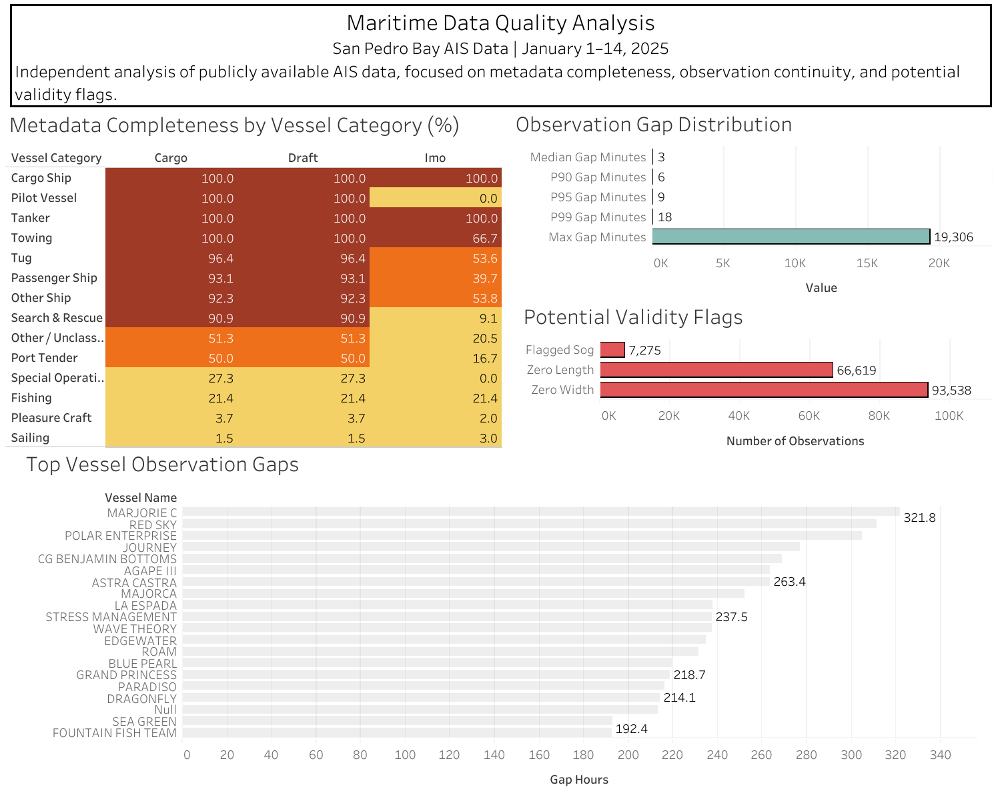
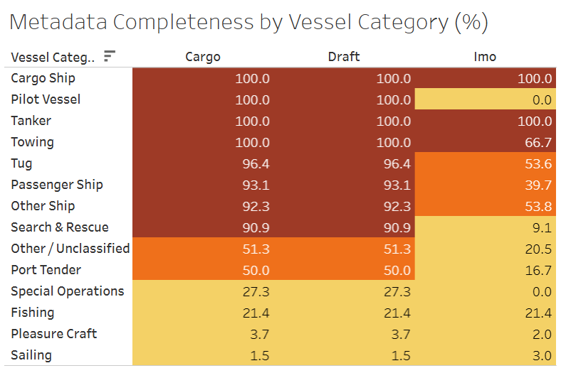
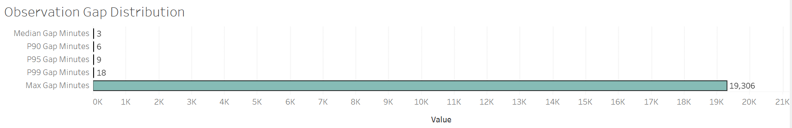
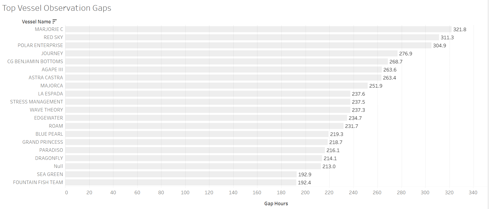
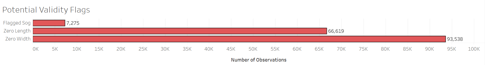

# Maritime Data Quality Analysis

### Independent AIS Data-Quality Case Study | San Pedro Bay | January 1–14, 2025

---

## Dashboard Preview

## Project Visualizations

📊 **[Open Tableau Public interactive Dashboard](https://public.tableau.com/views/MaritimeDataQualityAnalysisSanPedroBayAIS/MaritimeDataQualityAnalysis)**

🧪 **[View R Analysis](https://01a10ca6-0bc9-45e2-03c0-7f001cd07dc1.share.connect.posit.cloud/)**
---

## Business Objective

The objective of this independent analysis is to evaluate the quality and consistency of publicly available Automatic Identification System (AIS) vessel-tracking data and demonstrate a practical data-quality workflow relevant to maritime market-data operations.

The project focuses on three areas:

- **Metadata completeness** — determining how consistently important vessel attributes are populated across vessel categories.
- **Observation continuity** — measuring how consistently vessel observations occur and identifying unusually long observation gaps.
- **Field validity** — screening key movement and vessel-characteristic fields for potentially anomalous values requiring further validation.

The project was inspired by the type of data-quality responsibilities described in Kpler's **Junior Market Data Analyst – Chartering** role, including vessel data validation, vessel characteristics, vessel positions, SQL-based analysis, and repeatable quality checks.

This is an **independent portfolio project**, not a Kpler project.

---

## Key Insights

### 1. Metadata completeness varies substantially by vessel category

Completeness differed sharply across vessel categories.

Cargo Ships and Tankers showed **100% completeness** for the three primary fields examined — Cargo, Draft, and IMO — while Pleasure Craft showed only **3.7% Cargo completeness, 3.7% Draft completeness, and 2.0% IMO completeness**.

This demonstrates why data-quality monitoring can benefit from segmentation by vessel category rather than relying only on overall dataset-level completeness.

### 2. Most vessel observations occur within a few minutes

The median observation gap was only **3 minutes**.

The percentile distribution was:

| Metric | Gap |
|---|---:|
| Median | 3 minutes |
| P90 | 6 minutes |
| P95 | 9 minutes |
| P99 | 18 minutes |
| Maximum | 19,306 minutes |

The first four statistics indicate a generally frequent observation cadence, while the maximum reveals the presence of extreme gaps requiring investigation.

### 3. Extreme observation gaps exist at vessel level

The longest observed gap was **19,306 minutes**, equivalent to approximately **321.8 hours**.

The longest individual vessel-level gaps included:

- **MARJORIE C** — 321.8 hours
- **RED SKY** — 311.3 hours
- **POLAR ENTERPRISE** — 304.9 hours
- **JOURNEY** — 276.9 hours

These observations were treated as investigation candidates rather than automatically classified as data errors.

### 4. Potential validity flags were concentrated in vessel dimensions

The structural screening checks identified:

- **93,538** zero-width observations
- **66,619** zero-length observations
- **7,275** flagged SOG observations
- **0** invalid latitude observations
- **0** invalid longitude observations
- **0** invalid COG observations
- **0** negative length observations
- **0** negative width observations

These are **potential validity flags, not confirmed errors**. Source-data semantics and operational context are required before deciding whether a flagged value represents a genuine data-quality issue.

---

## Technical Summary

| **Aspect** | **Details** |
| --- | --- |
| **Tools Used** | DuckDB, SQL, R, R Shiny, Tableau Public |
| **Data Source** | NOAA / MarineCadastre AIS Vessel Tracks 2025 |
| **Study Area** | San Pedro Bay, California |
| **Study Period** | January 1–14, 2025 |
| **Observations** | 2,210,745 |
| **Unique Vessels** | 1,039 |
| **Fields** | 17 |
| **Techniques** | Data profiling, aggregation, SQL window functions, completeness analysis, temporal-gap analysis, structural validity checks |
| **Visuals** | Tableau heatmap, bar charts, summary metrics, R Shiny dashboard |
| **Purpose** | Evaluate AIS metadata completeness, observation continuity, and potential data-quality issues |

---

## Data Preparation & Cleaning

The analysis began with publicly available NOAA AIS vessel-track data covering a defined geographic area in San Pedro Bay.

The working dataset contained:

- **2,210,745 AIS observations**
- **1,039 unique vessels**
- **14 days of observations**
- **17 fields**

Key preparation activities included:

- Defining the geographic study area.
- Limiting the analysis to January 1–14, 2025.
- Profiling the structure and time coverage of the dataset.
- Preserving the original AIS fields and source values.
- Creating vessel-category interpretations while retaining the original vessel-type codes.
- Measuring missing metadata rather than automatically treating missing values as errors.
- Calculating consecutive observation intervals within each vessel.
- Applying structural screening checks to movement and vessel-characteristic fields.

No values were silently overwritten simply because they appeared unusual or missing.

---

## Functions & Techniques Used

### SQL / DuckDB

The core analysis was performed locally using DuckDB and SQL against the working AIS dataset.

Key techniques included:

- `COUNT()` and `COUNT(DISTINCT ...)` for dataset and vessel profiling.
- `MIN()` and `MAX()` for determining temporal coverage.
- `GROUP BY` for vessel-category comparisons.
- `CASE WHEN` logic for completeness and classification.
- `FILTER` expressions for targeted validity checks.
- `LAG()` window functions to compare consecutive observations for each vessel.
- `EPOCH()` calculations to measure time differences between observations.
- `MEDIAN()` and `QUANTILE_CONT()` to summarize observation-gap distributions.
- Aggregation and sorting to identify vessels with the longest observed gaps.
- Reusable SQL scripts to make the analysis reproducible.

### R

R was used to create supporting visualizations and provide an additional analytical perspective on the results.

Key techniques included:

- Working with the analytical CSV outputs generated from the SQL workflow.
- `ggplot2` for data visualization.
- Comparative bar charts for metadata completeness.
- Observation-gap distribution visualizations.
- Ranking visualizations for the longest vessel observation gaps.
- Visual summaries of potential validity flags.
- Shiny for interactive presentation of the analytical results.

### Tableau Public

Tableau Public was used to create the primary interactive visualization for the project.

Key techniques included:

- Heatmap visualization for metadata completeness.
- Summary metrics for observation-gap distribution.
- Horizontal bar charts for vessel-level observation gaps.
- Structural validity-flag visualization.
- Sorting and formatting to emphasize the most relevant findings.
- Dashboard composition combining the three main analytical questions into one view.

---

# Analysis Breakdown

## 1. Metadata Completeness by Vessel Category

The first analysis examines whether important vessel metadata is consistently populated across different vessel categories.

The analysis focused on the following fields:

- IMO
- Draft
- Cargo
- Vessel Name
- Length
- Width

Completeness differed substantially between vessel categories.

Cargo Ships and Tankers showed complete coverage for the primary fields examined, while Pleasure Craft and Sailing vessels showed substantially lower completeness.

For example, Pleasure Craft had only:

- **3.7%** Cargo completeness
- **3.7%** Draft completeness
- **2.0%** IMO completeness

This demonstrates why data-quality monitoring can benefit from **segmentation by vessel category** rather than relying only on overall dataset-level completeness.

### Tableau Visualization

---

## 2. Observation Gap Distribution

The second analysis evaluates how consistently vessels are observed over time.

Consecutive timestamps were calculated separately for each vessel using a SQL `LAG()` window function.

The resulting observation-gap distribution was:

| Metric | Gap |
| --- | ---: |
| Median | 3 minutes |
| P90 | 6 minutes |
| P95 | 9 minutes |
| P99 | 18 minutes |
| Maximum | 19,306 minutes |

The relatively low median and percentile values indicate that vessel observations generally occur at frequent intervals within the study period.

However, the maximum gap is substantially larger than the typical observation interval, highlighting the existence of extreme cases that warrant further investigation.

### Tableau Visualization

---

## 3. Longest Vessel Observation Gaps

The third analysis moves from the overall distribution to individual vessels.

The largest observed vessel-level gaps included:

| Vessel | Gap |
| --- | ---: |
| MARJORIE C | 321.8 hours |
| RED SKY | 311.3 hours |
| POLAR ENTERPRISE | 304.9 hours |
| JOURNEY | 276.9 hours |
| CG BENJAMIN BOTTOMS | 268.7 hours |

The longest observed gap was approximately **321.8 hours**, equivalent to **19,306 minutes**.

These observations were treated as **investigation candidates rather than automatically classified as errors**. A long AIS observation gap can have different possible explanations, and additional operational or source-level context would be required before determining its cause.

### Tableau Visualization

---

## 4. Potential Validity Flags

The final analytical question examines potentially anomalous values in selected movement and vessel-characteristic fields.

The structural screening identified:

| Check | Records |
| --- | ---: |
| Zero Width | 93,538 |
| Zero Length | 66,619 |
| Flagged SOG | 7,275 |
| Invalid Latitude | 0 |
| Invalid Longitude | 0 |
| Invalid COG | 0 |
| Negative Length | 0 |
| Negative Width | 0 |

The presence of a flagged value does **not** automatically mean that the underlying record is incorrect.

Zero or unusual values may represent missing, unavailable, default, or otherwise source-specific values. Further validation against source documentation and operational context would therefore be required before transforming or removing these records.

### Tableau Visualization

---

# Supporting R Analysis

The same analytical outputs were also explored through R to provide an additional perspective on the results.

The R analysis contains four supporting visualizations covering:

- Metadata completeness by vessel category.
- Observation-gap distribution.
- Longest observed vessel gaps.
- Potential validity flags.

# R Analysis Application

The supporting R implementation is also available through a published Shiny application:

**[View the R Analysis](https://01a10ca6-0bc9-45e2-03c0-7f001cd07dc1.share.connect.posit.cloud/)**
---

---

# Data Quality Recommendations

Based on the findings from this independent analysis, several areas would be suitable for further investigation in a production data-quality workflow.

### 1. Monitor completeness by vessel category

Overall completeness percentages can hide substantial differences between vessel categories.

A category-level monitoring process could track important fields such as:

- IMO
- Draft
- Cargo
- Vessel Name
- Length
- Width

This would make it easier to identify vessel categories where metadata quality consistently falls below an expected threshold.

### 2. Monitor observation continuity

Observation intervals can be monitored using vessel-level time-series checks.

Potential monitoring metrics could include:

- Median observation interval.
- P90, P95, and P99 gap thresholds.
- Number of extreme observation gaps.
- Vessels experiencing repeated long gaps.
- Geographic or operational concentration of gaps.

### 3. Investigate validity flags before applying automated cleaning

Potentially anomalous values should be investigated before being removed or overwritten.

A production workflow could distinguish between:

- Confirmed invalid values.
- Missing or unavailable values.
- Source-system defaults.
- Values requiring contextual validation.

This reduces the risk of accidentally removing useful information from the dataset.

### 4. Develop repeatable data-quality monitoring

The SQL workflow created for this project could be extended into a recurring quality-monitoring process.

Future datasets could automatically generate:

- Completeness metrics.
- Temporal continuity metrics.
- Validity flags.
- Category-level quality scores.
- Exception lists requiring investigation.

---

# Project Limitations

This project has several important limitations:

- The analysis uses a defined **San Pedro Bay geographic area** rather than global AIS coverage.
- The study period covers **January 1–14, 2025** rather than a full year.
- The project uses publicly available NOAA AIS data and does not use proprietary Kpler datasets.
- The analysis identifies potential data-quality issues but does not establish the operational cause of every anomaly.
- Long observation gaps were identified as investigation candidates, not confirmed transmission failures.
- Potential validity flags were not automatically treated as errors.
- Vessel-type categories were created for analytical readability while preserving the original AIS codes.
- The project does not claim to reproduce Kpler's internal data pipelines, quality rules, systems, or methodologies.

---

# Independence & Data Source Disclaimer

This is an **independent portfolio project**.

The project was inspired by the type of data-quality responsibilities described in publicly available maritime market-data roles, particularly the analysis and validation of vessel characteristics, vessel positions, and structured maritime data.

It does **not** use:

- Kpler proprietary data.
- Kpler internal systems.
- Kpler confidential information.
- Kpler APIs or private datasets.
- Any non-public company information.

The analysis was conducted using publicly available AIS data and independently developed SQL, R, and Tableau workflows.

### Public Data Source

The AIS data used in this project was obtained from NOAA / MarineCadastre's publicly available vessel-track resources.

---

# Project Documentation

The complete project workflow is documented using the six stages of the analytical process:

### ASK
[`01_ask.md`](01_ask.md)

Defines the project context, analytical approach, and three questions developed from the initial exploration of the public AIS dataset.

### PREPARE
[`02_prepare.md`](02_prepare.md)

Documents the data source, geographic study area, study period, dataset structure, and preparation decisions.

### PROCESS
[`03_process.md`](03_process.md)

Documents the DuckDB and SQL processing workflow, including profiling, metadata analysis, temporal-gap calculations, and validity checks.

### ANALYZE
[`04_analyze.md`](04_analyze.md)

Documents the analytical findings and interpretation of the three main questions.

### SHARE
[`05_share.md`](05_share.md)

Documents how the findings were transformed into visualizations and presented through Tableau and R.

### ACT
[`06_act.md`](06_act.md)

Documents the conclusions, recommendations, limitations, and potential next steps based on the analysis.

---

# SQL Analysis

The SQL workflow is organized into reusable scripts:

- [`sql/01_profile.sql`](sql/01_profile.sql) — Dataset profiling.
- [`sql/02_metadata_quality.sql`](sql/02_metadata_quality.sql) — Metadata completeness analysis.
- [`sql/03_temporal_gaps.sql`](sql/03_temporal_gaps.sql) — Observation-gap analysis.
- [`sql/04_validity_checks.sql`](sql/04_validity_checks.sql) — Structural validity checks.
- [`sql/05_final_metrics.sql`](sql/05_final_metrics.sql) — Consolidated final metrics.

### Data Documentation

- [`data/README.md`](data/README.md) — Working dataset documentation.
- [`data/vessel_type_reference.md`](data/vessel_type_reference.md) — AIS vessel-type mapping reference.

The original large raw AIS dataset is not included in the repository.

---

# Analytical Outputs

The smaller analytical output files used to create the visualizations include:

- `metadata_completeness.csv`
- `gap_summary.csv`
- `long_gap_vessels.csv`
- `validity_flags.csv`

These outputs allow the visualization layer to work with compact analytical datasets rather than requiring the large raw AIS file to be included in the repository.

---

# Future Improvements

If this project were extended beyond the current portfolio scope, possible next steps would include:

- Expanding the analysis to a longer time period.
- Comparing multiple ports or geographic regions.
- Building automated data-quality scoring.
- Tracking quality metrics across repeated data releases.
- Investigating the operational causes behind extreme observation gaps.
- Comparing AIS metadata completeness across additional vessel categories.
- Adding automated quality alerts for newly detected anomalies.
- Incorporating additional publicly available maritime reference data for validation.

---

# Conclusion

This project demonstrates an end-to-end data-quality workflow using a large real-world maritime dataset.

Starting from publicly available AIS data, the workflow progressed through:

**ASK → PREPARE → PROCESS → ANALYZE → SHARE → ACT**

The analysis identified meaningful differences in metadata completeness, quantified vessel observation continuity, highlighted extreme observation gaps, and screened millions of AIS records for potential validity issues.

More importantly, the project demonstrates the ability to move from raw operational data to **reproducible SQL analysis, evidence-based findings, and decision-oriented visualizations** without relying on proprietary data.

---

# Author

**Mohamed Nidal E. Loucif**

Data Analytics | Operations | Aviation & Maritime Data

- **GitHub:** [LoucifNidal](https://github.com/LoucifNidal)
- **Portfolio:** [loucifnidal.github.io](https://loucifnidal.github.io/)
- **Kaggle:** [Nidal Loucif](https://www.kaggle.com/nidalloucif)

### Project Visualizations

- 📊 **[Tableau Public Dashboard](https://public.tableau.com/views/MaritimeDataQualityAnalysisSanPedroBayAIS/MaritimeDataQualityAnalysis)**
- 🧪 **[R Analysis](https://01a10ca6-0bc9-45e2-03c0-7f001cd07dc1.share.connect.posit.cloud/)**)

---

**Built as an independent data analytics portfolio project using publicly available AIS data.**
